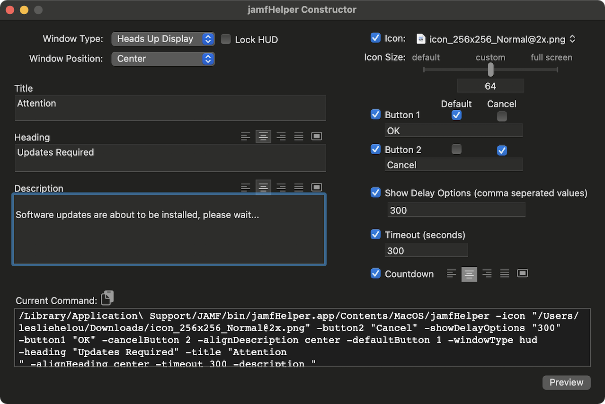
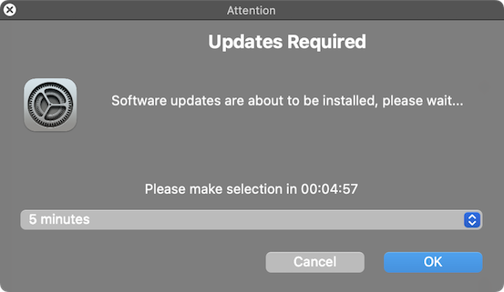

# jamfHelper Constructor

  
    
 

Download: [jhc](https://github.com/BIG-RAT/jhc/releases/latest/download/jhc.zip)

Just a little app to help build and preview a jamfHelper window.

Icon selection can be accomplished either by dragging the icon onto the dropdown button or clicking the button and browsing to the file.

Line returns can be added to the heading or description by using option+return within the text field.

Use the preview button to verify the command displays the desired look.

The preview will quit after 15 seconds if left alone.

## History

- 2025-06-18 v1.0.0: Better handling of special characters. Add version check. Fix dock icon size.

- 2022-09-19 v0.9.0: Add check for jamfHelper before generating preview.  Fix button1/button2 not updating command line as options are checked/unchecked.

- 2021-05-09 v0.8.9: Initial post.
